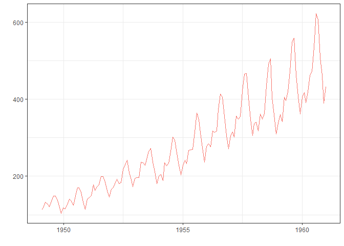

<!-- README.md is generated from README.Rmd, please edit that file -->

# dtseries

<!-- badges: start -->

[](https://lifecycle.r-lib.org/articles/stages.html#experimental)
<!-- badges: end -->

The goal of dtseries is to give R’s native `ts` class new capabilities
and functionalities related to time series management in R.

## Installation

You can install the development version of dtseries from
[GitHub](https://github.com/) with:

``` r
# install.packages("remotes")
remotes::install_github("adatar-do/dtseries")
```

## Example

This is a basic example which shows you how to solve a common problem:

``` r
library(dtseries)

AirPassengers %>% 
  dts_ts_ggplot()
```



## Functionalities

- **Time Series Transformation:**
  - `dts_transform()`: Applies any function to a `ts` object
- **Time Series Manipulation:**
  - `dts_concat()`: Concatenates time series.
  - `dts_resize()`: Resizes a time series based on a reference time
    series.
  - `dts_sub()`: Subtracts two time series objects.
- **Missing Value Management**
  - `dts_zero()`: Create a time series object filled with zeros.
- **Time Series Features:**
  - `dts_dummy()`: Creates a time series dummy variable based on
    provided dates.
  - `dts_seas()`: Generates seasonal dummy variables.
- **Time Series Analysis:**
  - `dts_stationarity_test()`: Performs the Augmented Dickey-Fuller
    test.
  - `dts_breakpoints()`: Detects and visualizes breakpoints in time
    series.
- **Visualization:**
  - `dts_ts_ggplot()`: Creates a ggplot object for time series.
  - `seasonal_plot()`: Generates a seasonal plot.
  - `train_test_plot()`: Plots train and test sets.
  - `dts_acf_plot()`: Plots ACF and PACF.
  - `dts_stl_plot()`: Performs and plots STL decomposition.
- **General:**
  - `dts_name()`: Set a name to a `ts` object.
  - `dts_merge()`: Merges time series by date.
- **And more!**
